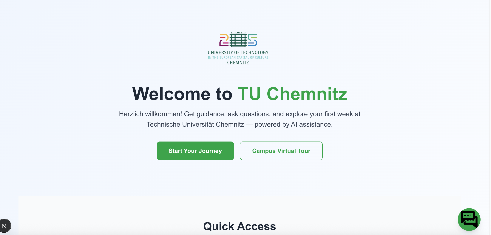

**LLM CHATBOT PROJECT - THE PROJECT FOR MASTER THESIS**  


---

## 🧭  Getting started


This project investigates how Large Language Models (LLMs) can produce structured, user-customized outputs - such as cards, buttons, carousels, and links — to enhance clarity, usability, and task efficiency for international students during their TU Chemnitz onboarding process.

Two chatbot versions were implemented:

- **Version A – Unstructured:** Traditional text-based responses similar to ChatGPT-style paragraphs.

- **Version B – Structured:** LLM-generated responses in JSON following pre-defined schemas that map to GUI elements such as cards, buttons, and links.

Both versions share the same retrieval and knowledge sources but differ in output format and rendering logic.
This allows for a direct comparison between unstructured and structured interactions.

## ✨  Features

- **Dual Implementation**: Side-by-side comparison of structured vs. unstructured outputs
- **Interactive Elements**: Cards, buttons, carousels, and contextual links in structured version
- **Docker Containerization**: Easy setup and deployment
- **RESTful API**: Backend service for chatbot functionality
- **Responsive Frontend**: Modern web interfaces for both versions

## 🧰 Technical Stack

### Frontend
- **Framework:** Next.js (React-based)
- **Styling:** Tailwind CSS for responsive UI
- **Rendering Logic:** Dynamic components for structured outputs (`CardComponent`, `CarouselComponent`, `ButtonList`, `LinkList`)
- **Deployment:** Vercel for cloud hosting and demo access

### Backend
- **Framework:** FastAPI (Python)
- **LLM Integration:** OpenAI API 
- **Retrieval-Augmented Generation (RAG):** Combines document embeddings and context retrieval for accurate answers
- **Data Storage:** FAISS for vector search and metadata handling
- **Prompt Management:** Dedicated templates for structured and unstructured outputs

### Containerization
- **Tooling:** Docker & Docker Compose for reproducible environments
- **Purpose:** Isolates frontend, backend, and database for easy deployment

### Data & Output Formats
- **Structured Output:** JSON schemas defining cards, buttons, carousels, and links
- **Unstructured Output:** Plain text generated via LLM response
- **Evaluation Data:** Collected from user testing and interviews  

## ⚙️ Installation (development)

### Step 1: clone the project

**Option 1**: **Clone the Project from GitLab**

Open a terminal and clone the repository from TU Chemnitz GitLab:
   ```bash
   ## use SSH
   git clone git@gitlab.hrz.tu-chemnitz.de:vsr/edu/advising/ma-yen-nguyen.git
   ## OR use https
   git clone https://gitlab.hrz.tu-chemnitz.de/vsr/edu/advising/ma-yen-nguyen.git
   
   cd ma-yen-nguyen
```

**Option 2**: **Extract from Zip**

- Download zip file from GitLab or extract from provided USB
- Navigate to the project folder

### Step 2: Set Environment Variables

- Create `.env` file and copy `.env.example` to `.env` inside root directories.

- Fill in your keys or local settings as required.

### Step 3: Run program in docker

1. Make sure **Docker Desktop** is running.  
2. From the **root directory** of the project, run:
   ```bash
   docker compose build
   docker compose up 
   ```

### Once containers are running:

Frontend for baseline chatbot (only plain text): http://localhost:3000

Frontend for structured outputs chatbot: http://localhost:3001

Backend API: http://localhost:8000

### To stop all services:
```bash
docker compose down
```

## 💬 Chat with chatbot

After launching the frontend:

- You will see a mock-up website with a chat icon on the bottom-right corner.


- Click the icon to open the chat widget and start your conversation.

- Version A (plain text) displays traditional messages, while Version B (structured) renders interactive UI components like cards, buttons, links, etc.

## 🌐 Production Deployment

This project has been deployed temporarly in Vercel. For simple user please follow the link:
- https://chatbot-tuc-plain.vercel.app (for plain text chatbot)
- https://chatbot-tuc-so.vercel.app/ (for structured outputs chatbot)

** Note: The server can be down if the author stop it. Please contact to author if you if you believe the server is not responding.


## 🗺️ Roadmap

This project was developed as part of a master thesis and can be extended in future research or coursework.  
Potential next steps include:
- 🔍 Expanding RAG integration with multiple document sources (web scraping or APIs)  
- 🧠 Adding support for other LLM backends (Gemini, Claude, or local open models)  
- 🗣️ Incorporating multilingual output (English + German) for onboarding support  
- 🧩 Enhancing structured response variety with more UI templates (e.g., lists, tables)  
- 📊 Conducting a larger-scale user study to evaluate structured vs. unstructured responses  

---

## 🤝 Contributing

This repository primarily serves academic and research purposes.  
However, contributions for **bug fixes**, **UI improvements**, or **additional response templates** are welcome.

To contribute:
1. Fork the repository  
2. Create a new branch for your feature  
3. Make and test your changes  
4. Submit a merge request for review  

## 👩‍💻 Authors and Acknowledgments

**Author**: Yen  Nguyen

**Affiliation**: Technische Universität Chemnitz, Faculty of Computer Science

**Acknowledgments**:

Special thanks to the VSR Research Group for their guidance, resources, and feedback throughout the development of this project.
Gratitude is also extended to the international students who participated in the user testing and evaluation phase.

## 🚧 Project Status

**Status**: Active (Research Complete - Refinement for Future work)

- Development of the main chatbot system is complete.

- Docker and deployment configurations are stable.

- Future updates may focus on adding multilingual support and larger-scale user evaluation.

- If the author is no longer maintaining this repository, you may fork it for educational or research purposes with proper citation of the original work.

## 📜 License

This project was created by **Yen Nguyen** as part of a **Master Thesis** at  
**Technische Universität Chemnitz, Faculty of Computer Science**.

The source code, documentation, and related assets are © 2025 **Yen Nguyen**.  
All rights reserved.

The project is distributed for **academic and non-commercial research purposes only**.  
No part of this work may be used for commercial gain without written permission from the author.

For collaboration, academic reuse, or research inquiries, please contact:  
thi-ngoc-yen.nguyen@s2022.tu-chemnitz.de